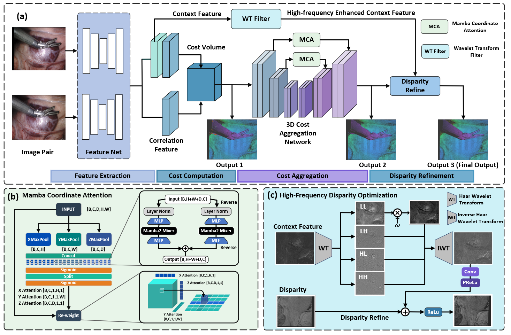
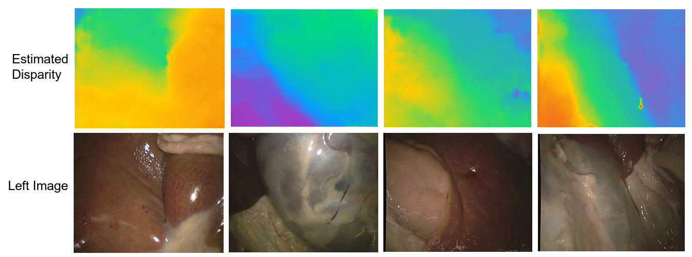

# LightEndoStereo
<div>
<a href="https://github.com/Sonne-Ding/LightEndoStereo">

</a>
<a href="https://arxiv.org/abs/2503.00731">

</a>
</div>

Real-time acquisition of accurate depth of scene is essential for automated robotic minimally invasive surgery, and stereo matching with binocular endoscopy can generate such depth. However, existing algorithms struggle with ambiguous tissue boundaries and real-time performance in prevalent high-resolution endoscopic scenes. We propose LightEndoStereo, a lightweight real-time stereo matching method for endoscopic images. We introduce a 3D Mamba Coordinate Attention module to streamline the cost aggregation process by generating position-sensitive attention maps and capturing long-range dependencies across spatial dimensions using the Mamba block. Additionally, we introduce a High-Frequency Disparity Optimization module to refine disparity estimates at tissue boundaries by enhancing high-frequency information in the wavelet domain. Our method is evaluated on the SCARED and SERV-CT datasets, achieving state-of-the-art matching accuracy and a real-time inference speed of __42 FPS__.

## Framework


## Dataset Process
We use [scared_tookit](https://github.com/dimitrisPs/scared_toolkit) to extract the disparity map and depth map of SCARED dataset.
If you want to use our dataloader, the folder structure should be:
```
├── dataset_*/
│   ├── keyframe_*/
│   │   ├── data/
│   │   │   ├── disparity/
│   │   │   ├── left_rectified/
│   │   │   └── right_rectified/
```
The data file list yaml is :
```
train:
    disparity:
        - dataset_*/keyframe_*/data/disparity/******.tiff
    img_l:
        - dataset_*/keyframe_*/data/left_rectified/******.tiff
    img_r:
        - dataset_*/keyframe_*/data/right_rectified/******.tiff
val:
    disparity:
        - dataset_*/keyframe_*/data/disparity/******.tiff
    img_l:
        - dataset_*/keyframe_*/data/left_rectified/******.tiff
    img_r:
        - dataset_*/keyframe_*/data/right_rectified/******.tiff
test:
    dataset_8:
        disparity:
            - dataset_8/keyframe_*/data/disparity/******.tiff
        img_l:
            - dataset_8/keyframe_*/data/left_rectified/******.tiff
        img_r:
            - dataset_8/keyframe_*/data/right_rectified/******.tiff
    dataset_9:
        disparity:
            - dataset_9/keyframe_*/data/disparity/******.tiff
        img_l:
            - dataset_9/keyframe_*/data/left_rectified/******.tiff
        img_r:
            - dataset_9/keyframe_*/data/right_rectified/******.tiff

```


## Samples
Using dataset [SCARED](https://endovissub2019-scared.grand-challenge.org) and [SERV-CT](https://www.ucl.ac.uk/interventional-surgical-sciences/weiss-open-research/weiss-open-data-server/serv-ct).
### Samples on SCARED


<!-- <embed src="./assets/videos/LightEndoStereo_demo.mp4" /> -->
<object data="./assets/videos/LightEndoStereo_demo.mp4"></object>

### Samples on SERV-CT


## Acknowledgement
- [OpenStereo](https://github.com/XiandaGuo/OpenStereo)    
- [scared toolkit](https://github.com/dimitrisPs/scared_toolkit)
- [GwcNet](https://github.com/xy-guo/GwcNet)